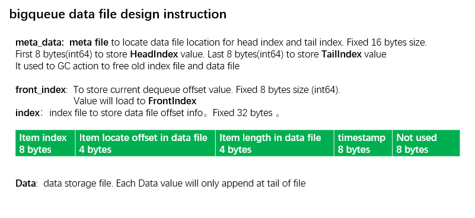
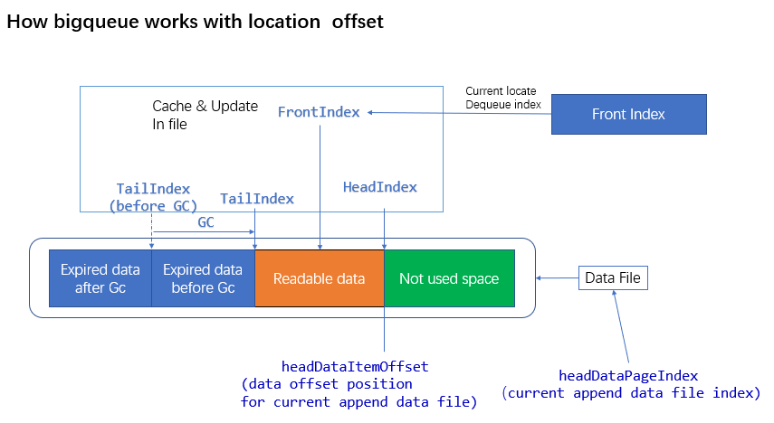

<h1 align="center">BigQueue-go</h1>

<p align="center">
BigQueue-go is pure Golang implementation for big, fast and persistent queue based on memory mapped file. Its file storage structures is totally compatible with 
[BigQueue](https://github.com/bulldog2011/bigqueue)
</p>

[](https://goreportcard.com/report/github.com/jhunters/bigqueue)
[](https://travis-ci.org/jhunters/bigqueue)
[](https://codecov.io/gh/jhunters/bigqueue)
[](https://github.com/jhunters/bigqueue/releases)
[](https://godoc.org/github.com/jhunters/bigqueue)
[](https://github.com/jhunters/bigqueue/blob/master/LICENSE)

## Feature Highlight:  
1. **Fast**: close to the speed of direct memory access, both enqueue and dequeue are close to O(1) memory access.  
2. **Big**: the total size of the queue is only limited by the available disk space.  
3. **Persistent**: all data in the queue is persisted on disk, and is crash resistant.
4. **Reliable**: OS will be responsible to presist the produced messages even your process crashes.  
5. **Realtime**: messages produced by producer threads will be immediately visible to consumer threads.
6. **Memory-efficient**: automatic paging & swapping algorithm, only most-recently accessed data is kept in memory.  
7. **Thread-safe**: multiple threads can concurrently enqueue and dequeue without data corruption. 
8. **Simple&Light** : pure Golang implements without any 3rd-party library

## Quick Start

### Installing 

To start using BigQueue-Go, install Go and run `go get`:

```sh
$ go get github.com/jhunters/bigqueue
```

### Importing bigqueue

To use bigqueue as an file implements queue, import as: 

```go

import	"github.com/jhunters/bigqueue"

func main() {
	var queue = new(bigqueue.FileQueue)

	err := queue.Open(".", "testqueue", nil)

	if err != nil {
		fmt.Println(err)
		return
	}
	defer queue.Close()
	
	data := []byte("hello jhunters")
	
	i, err := queue.Enqueue(data)
	if err != nil {
		fmt.Println(err)
		return
	} else {
		fmt.Println("Enqueued index=", i, string(data))
	}
	
	index, bb, err := queue.Dequeue()
	if err != nil {
		fmt.Println(err)
		return
	}
	
	fmt.Println("Dequeue data:", index, string(bb))
}
```

## Docs
1. [big queue tutorial](./docs/QueueTutorial.md)
2. [fanout queue tutorial](./docs/FanoutQueueTutorial.md)

## The Big Picture







## Benmark test
```sh
$ go test -bench=. -benchtime=3s -run=^$
```

```property
goos: linux
goarch: amd64
pkg: github.com/bigqueue
Benchmark_EnqueueOnly-8                  2319403              1479 ns/op
Benchmark_DequeueOnly-8                  4704715               743 ns/op
Benchmark_EnqueueDequeue-8               1536244              2303 ns/op
Benchmark_ParallelEnqueueDequeue-8       1254315              2760 ns/op
PASS
ok      github.com/bigqueue     40.028s
```


## License
BigQueue-Go is [Apache 2.0 licensed](./LICENSE).
